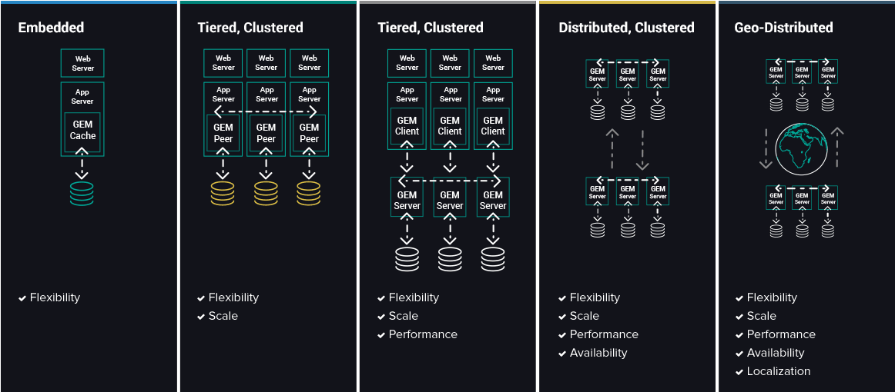

# Gemfire Server Topology
Below diagram shows different way of setting up gemfire server.

1.First one is embadded server, We can create spring boot application and it would start embadded server and cache the data.

   Refer Project : gemfire-topology-1
   
2.Seconds one is starting Spring boot application with client server topology, Each spring boot application would start gemfire server internally and it would form cluster, each spring boot application act as a data node in the cluster.

  Refer Project : gemfire-topology-2
  
3.Thirde one is, Spring boot act as client and it would store the data data at server side by connecting gemfire server using gemfire locator/server. 

  Refer Project : gemfire-topology-3

# Example for Topology-3

## Spring Boot Gemfire (Client/Server)(Topology-3)

This spring boot application act as a client and gemfire server will be the data node which we need to install separatly

## Steps to install gemfire server on your local machine
 1. https://gemfire.docs.pivotal.io/gemfire/getting_started/installation/install_brew.html

 2. Enter gfsh

kaleeswarans-MacBook-Pro:~ kaleeswarankaruppusamy$ gfsh

    _________________________     __
   / _____/ ______/ ______/ /____/ /
  / /  __/ /___  /_____  / _____  / 
 / /__/ / ____/  _____/ / /    / /  
/______/_/      /______/_/    /_/    9.2.0

Monitor and Manage Pivotal GemFire
gfsh>

### Command to Start Locator

gfsh>start locator —-name=locator --port=10336 --bind-address=localhost --hostname-for-clients=localhost 

### Start Server

gfsh>start server --hostname-for-clients=localhost --bind-address=localhost --name=server1 --server-port=40408

### Create Region
We have to create Region to store our entity, we have to create region in gemfire for each entity.
In the example Peron and address entity are used. so we have to create region for that

gfsh>create region --name=Person --type=REPLICATE
gfsh>create region --name=Address --type=REPLICATE

### Deploy Jar

gfsh>deploy --jar=<PROJECTPATH>gemfire/target/gemfire-poc-client-0.1.0-domain.ja

### Query

gfsh>query --query="select * from /Person"

## Start spring boot application

Store spring boot application and store data into gemfire cluster server

### Request :

http://localhost:4040/person

{
	"id":1,
	"firstName": "kaleeswara",
	"lastName":"karuppusamy"
}

localhost:4040/address

{
	"id":1,
	"address": "YISHUN",
	"postal":"780210"
}

